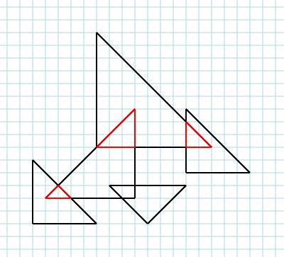

# Intersecting Triangles

### For You: The Test

> For this test, you will build a simple HTTP API in your language of choice, that will accept as input, a collection of tuples. Each tuple consists of three cartesian natural number co-ordinates, each representing a triangle on a 2D Plane. The API will then respond with an identically formed collection of intersecting triangles.

> Using the diagram above as an example, the input would consist of 5 tuples and the response would consist of three tuples.

### For Us: The Problem

> All API calls should implement sufficient validation as to ensure that the request is well-formed. Accompanying tests should verify any validation against numerous variations of bad requests.

> A separate API call should be implemented that returns the cumulative total area of all intersecting triangles. The technical test should require this functionality to be implemented and fully tested.

## Things to Remember

* You can use _any_ language and technology that you think appropriate to efficiently solve this problem. We recommend using a development tool similar to [docker-compose](https://docs.docker.com/compose/) if you wish to incorporate the use of installation-required software.

* You are composing a technical test for us to complete for you. Document and instruct us in a way you would expect to receive and complete a technical test.

* Your technical test should be available to us through Github or Bitbucket, as a public or private repository.

* You should include as much documentation as necessary for our developer(s) to be able to painlessly run your solution (assume a UNIX machine).

  **Note:** _Documentation is incredibly important at Stockflare. Being able to clearly describe your development process so that it may be easily reproduced is key._
